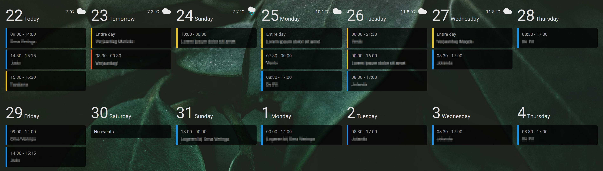

# Week Planner Card


[](https://www.buymeacoffee.com/rudygnodde)

Custom Home Assistant card displaying a responsive overview of multiple days with events from one or multiple calendars



## Table of Content

- [Installation](#installation)
  - [HACS (Recommended)](#hacs-recommended)
  - [Manual](#manual)
- [Configuration](#configuration)
  - [Main options](#main-options)
  - [Calendars](#calendars)
  - [Texts](#texts)
  - [Weather](#weather)
- [Custom styling using cardmod](#custom-styling-using-cardmod)
- [Examples](#examples)

## Installation

### HACS (Recommended)

1. Make sure [HACS](https://hacs.xyz) is installed and working.
2. Add this repository (https://github.com/FamousWolf/week-planner-card) via [HACS Custom repositories](https://hacs.xyz/docs/faq/custom_repositories)
3. Download and install using HACS

### Manual

1. Download and copy `week-planner-card.js` from the [latest release](https://github.com/FamousWolf/week-planner-card/releases/latest) into your `config/www` directory.
2. Add the resource reference to Home Assistant configuration using one of these methods:
  - **Edit your configuration.yaml**
    Add:
    ```yaml
    resources:
      - url: /local/week-planner-card.js?version=1.8.0
    type: module
    ```
  - **Using the graphical editor**
    1. Make sure advanced mode is enabled in your user profile
    2. Navigate to Configuration -> Lovelace Dashboards -> Resources Tab. Hit orange (+) icon
    3. Enter URL `/local/week-planner-card.js` and select type "JavaScript Module".
    4. Restart Home Assistant.


## Configuration

### Main Options

| Name                     | Type             | Default                                            | Supported options                                                                                                                           | Description                                                                            | Version |
|--------------------------|------------------|----------------------------------------------------|---------------------------------------------------------------------------------------------------------------------------------------------|----------------------------------------------------------------------------------------|---------|
| `type`                   | string           | **Required**                                       | `custom:week-planner-card`                                                                                                                  | Type of the card                                                                       | 1.0.0   |
| `title`                  | string           | optional                                           | Any string                                                                                                                                  | Card title                                                                             | 1.6.0   |
| `days`                   | number \| string | 7                                                  | Any positive integer number \| `month`                                                                                                      | The number of days to show                                                             | 1.0.0   |
| `startingDay`            | string           | `today`                                            | `today` \| `tomorrow` \| `yesterday` \| `sunday` \| `monday` \| `tuesday` \| `wednesday` \| `thursday` \| `friday` \| `saturday` \| `month` | Day to start with                                                                      | 1.2.0   |
| `startingDayOffset`      | number           | 0                                                  | Any integer number                                                                                                                          | Add or subtract days from starting day                                                 | 1.7.0   |
| `hideWeekend`            | boolean          | false                                              | `false` \| `true`                                                                                                                           | Do not show Saturday and Sunday                                                        | 1.2.0   |
| `noCardBackground`       | boolean          | false                                              | `false` \| `true`                                                                                                                           | Do not show default card background and border                                         | 1.0.0   |
| `eventBackground`        | string           | `var(--card-background-color, inherit)`            | Any CSS color                                                                                                                               | Background color of the events                                                         | 1.0.0   |
| `compact`                | boolean          | false                                              | `false` \| `true`                                                                                                                           | Use compact mode, decreasing several spacings and font sizes                           | 1.2.0   |
| `updateInterval`         | number           | 60                                                 | Any positive integer number                                                                                                                 | Seconds between checks for new events                                                  | 1.0.0   |
| `calendars`              | object list      | **Required**                                       | See [Calendars](#calendars)                                                                                                                 | Calendars shown in this card                                                           | 1.0.0   |
| `texts`                  | object list      | {}                                                 | See [Texts](#texts)                                                                                                                         | Texts used in the card                                                                 | 1.0.0   |
| `actions`                | object list      | {}                                                 | See [Actions](#actions)                                                                                                                     | Actions for the card                                                                   | 1.8.0   |
| `weather`                | object           | optional                                           | See [Weather](#weather)                                                                                                                     | Configuration for optional weather forecast                                            | 1.1.0   |
| `dayFormat`              | string           | optional                                           | See [Luxon format](https://moment.github.io/luxon/#/formatting?id=table-of-tokens)                                                          | Format of the date at the top of the day. This is not escaped, so HTML is allowed here | 1.6.0   |
| `dateFormat`             | string           | `cccc d LLLL yyyy`                                 | See [Luxon format](https://moment.github.io/luxon/#/formatting?id=table-of-tokens)                                                          | Format of the date in event details                                                    | 1.0.0   |
| `timeFormat`             | string           | `HH:mm`                                            | See [Luxon format](https://moment.github.io/luxon/#/formatting?id=table-of-tokens)                                                          | Format of the time                                                                     | 1.0.0   |
| `locale`                 | string           | `en`                                               | Any locale string supported by Luxon                                                                                                        | Locale used for day and month texts                                                    | 1.1.0   |
| `locationLink`           | string           | `https://www.google.com/maps/search/?api=1&query=` | Any URL                                                                                                                                     | Link used for event location in the detail popup                                       | 1.1.0   |
| `showLocation`           | boolean          | false                                              | `false` \| `true`                                                                                                                           | Show event location in overview                                                        | 1.3.0   |
| `hidePastEvents`         | boolean          | false                                              | `false` \| `true`                                                                                                                           | Do not show past events                                                                | 1.3.0   |
| `hideDaysWithoutEvents`  | boolean          | false                                              | `false` \| `true`                                                                                                                           | Do not show days without events, except for today                                      | 1.4.0   |
| `hideTodayWithoutEvents` | boolean          | false                                              | `false` \| `true`                                                                                                                           | Also do not show today without events if `hideDaysWithoutEvents` is set                | 1.8.0   |
| `filter`                 | string           | optional                                           | Any regular expression                                                                                                                      | Remove events that match the regular expression                                        | 1.7.0   |
| `combineSimilarEvents`   | boolean          | false                                              | `false` \| `true`                                                                                                                           | Combine events with the same start date/time, end date/time and title                  | 1.9.0   |

### Calendars

| Name           | Type    | Default      | Supported options      | Description                                     | Version |
|----------------|---------|--------------|------------------------|-------------------------------------------------|---------|
| `entity`       | string  | **Required** | `calendar.my_calendar` | Entity ID                                       | 1.0.0   |
| `name`         | string  | optional     | Any text               | Name of the calendar                            | 1.7.0   |
| `color`        | string  | optional     | Any CSS color          | Color used for events from the calendar         | 1.0.0   |
| `filter`       | string  | optional     | Any regular expression | Remove events that match the regular expression | 1.8.0   |
| `hideInLegend` | boolean | false        | `false` \| `true`      | Do not show the calendar in the legend          | 1.8.0   |

### Texts

| Name        | Type   | Default                           | Supported options | Description                                                                     | Version |
|-------------|--------|-----------------------------------|-------------------|---------------------------------------------------------------------------------|---------|
| `fullDay`   | string | `Entire day`                      | Any text          | Text shown for full day events instead of time                                  | 1.0.0   |
| `noEvents`  | string | `No events`                       | Any text          | Text shown when there are no events for a day                                   | 1.0.0   |
| `today`     | string | `Today`                           | Any text          | Text shown for today instead of the week day. Set to empty to show week day     | 1.0.0   |
| `tomorrow`  | string | `Tomorrow`                        | Any text          | Text shown for tomorrow instead of the week day. Set to empty to show week day  | 1.0.0   |
| `yesterday` | string | `Yesterday`                       | Any text          | Text shown for yesterday instead of the week day. Set to empty to show week day | 1.2.0   |
| `sunday`    | string | Name of Sunday based on locale    | Any text          | Text used to override Sundays                                                   | 1.1.0   |
| `monday`    | string | Name of Monday based on locale    | Any text          | Text used to override Mondays                                                   | 1.1.0   |
| `tuesday`   | string | Name of Tuesday based on locale   | Any text          | Text used to override Tuesdays                                                  | 1.1.0   |
| `wednesday` | string | Name of Wednesday based on locale | Any text          | Text used to override Wednesdays                                                | 1.1.0   |
| `thursday`  | string | Name of Thursday based on locale  | Any text          | Text used to override Thursdays                                                 | 1.1.0   |
| `friday`    | string | Name of Friday based on locale    | Any text          | Text used to override Fridays                                                   | 1.1.0   |
| `saturday`  | string | Name of Saturday based on locale  | Any text          | Text used to override Saturdays                                                 | 1.1.0   |

### Actions
See [Actions documentation](https://www.home-assistant.io/dashboards/actions/). Currently only the tab action is supported.

### Weather

| Name                 | Type    | Default      | Supported options            | Description                                                                    | Version |
|----------------------|---------|--------------|------------------------------|--------------------------------------------------------------------------------|---------|
| `entity`             | string  | **Required** | `weather.my_weather_service` | Entity ID                                                                      | 1.1.0   |
| `useTwiceDaily`      | boolean | false        | `false` \| `true`            | Use twice daily forecast if your weather entity doesn't support daily forecast | 1.9.0   |
| `showCondition`      | boolean | true         | `false` \| `true`            | Show condition icon                                                            | 1.1.0   |
| `showTemperature`    | boolean | false        | `false` \| `true`            | Show temperature                                                               | 1.1.0   |
| `showLowTemperature` | boolean | false        | `false` \| `true`            | Show low temperature                                                           | 1.1.0   |

## Custom styling using cardmod

Like with most cards, you can add custom styling to this card using [card_mod](https://github.com/thomasloven/lovelace-card-mod). To make it easier to add custom styles to days and/or events, there are several classes that days and events can have. Additionally, there are data attributes you can use in CSS selectors.

### Day classes

| Class       | Description        | Version |
|-------------|--------------------|---------|
| `today`     | The current day    | 1.5.0   |
| `tomorrow`  | The next day       | 1.5.0   |
| `yesterday` | The previous day   | 1.5.0   |
| `future`    | Day in the future  | 1.5.0   |
| `past`      | Day in the past    | 1.5.0   |
| `sunday`    | Day is a sunday    | 1.6.0   |
| `monday`    | Day is a monday    | 1.6.0   |
| `tuesday`   | Day is a tuesday   | 1.6.0   |
| `wednesday` | Day is a wednesday | 1.6.0   |
| `thursday`  | Day is a thursday  | 1.6.0   |
| `friday`    | Day is a friday    | 1.6.0   |
| `saturday`  | Day is a saturday  | 1.6.0   |

### Day data attributes

| Data attribute | Description        | Version |
|----------------|--------------------|---------|
| `data-date`    | The day number     | 1.7.0   |
| `data-weekday` | The weekday number | 1.7.0   |
| `data-month`   | The month number   | 1.7.0   |
| `data-year`    | The year           | 1.7.0   |
| `data-week`    | The week number    | 1.7.0   |


### Event classes

| Class     | Description              | Version |
|-----------|--------------------------|---------|
| `fullday` | Event lasts the full day | 1.5.0   |
| `ongoing` | Currently ongoing        | 1.5.0   |
| `future`  | Event in the future      | 1.5.0   |
| `past`    | Event in the past        | 1.5.0   |

### Event data attributes

| Data attribute             | Description                                                     | Version |
|----------------------------|-----------------------------------------------------------------|---------|
| `data-entity`              | The calendar entity                                             | 1.6.0   |
| `data-additional-entities` | Comma-separated list of additional entities for combined events | 1.9.0   |
| `data-summary`             | The event title                                                 | 1.9.0   |
| `data-location`            | The event location                                              | 1.9.0   |
| `data-start-hour`          | The event start hour                                            | 1.9.0   |
| `data-start-minute`        | The event start minute                                          | 1.9.0   |
| `data-end-hour`            | The event end hour                                              | 1.9.0   |
| `data-end-minute`          | The event end minute                                            | 1.9.0   |

## Examples

### Minimal

```yaml
type: custom:week-planner-card
calendars:
  - entity: calendar.my_calendar_1
```

### Extended

```yaml
type: custom:week-planner-card
calendars:
  - entity: calendar.my_calendar_1
    color: '#e6c229'
  - entity: calendar.my_calendar_2
    color: '#1a8fe3'
weather:
  entity: weather.my_weather_service
  showTemperature: true
  showLowTemperature: true
days: 14
noCardBackground: true
eventBackground: rgba(0, 0, 0, .75)
locationLink: https://www.openstreetmap.org/search?query=
locale: nl
texts:
  noEvents: Geen activiteiten
  fullDay: Hele dag
  today: Vandaag
  tomorrow: Morgen
```

### Starting on Sunday

```yaml
type: custom:week-planner-card
calendars:
  - entity: calendar.my_calendar_1
    color: '#e6c229'
  - entity: calendar.my_calendar_2
    color: '#1a8fe3'
startingDay: sunday
texts:
  today: ''
  tomorrow: ''
  yesterday: ''
```

### Past events transparent with card_mod

```yaml
type: custom:week-planner-card
calendars:
  - entity: calendar.my_calendar_1
    color: '#e6c229'
  - entity: calendar.my_calendar_2
    color: '#1a8fe3'
card_mod:
  style: |
    .event.past {
      opacity: .3;
    }
```

### Custom event style based on title text with card_mod

This will style events with `Word1` as part of the title or `Word2` as the exact title with a red background.

```yaml
type: custom:week-planner-card
calendars:
  - entity: calendar.my_calendar_1
  - color: #e6c229
card_mod:
  style: |
    .event[data-summary~="Word1"],
    .event[data-summary="Word2"] {
      background-color: #ff0000 !important;
    }
```

### Show entire current month

```yaml
type: custom:week-planner-card
calendars:
  - entity: calendar.my_calendar_1
days: month
startingDay: month
```

### Show month with each day

```yaml
type: custom:week-planner-card
calendars:
  - calendar.my_calendar_1
dayFormat: '''<span class="number">''d''</span> <span class="month">''MMMM''</span>'''
```
